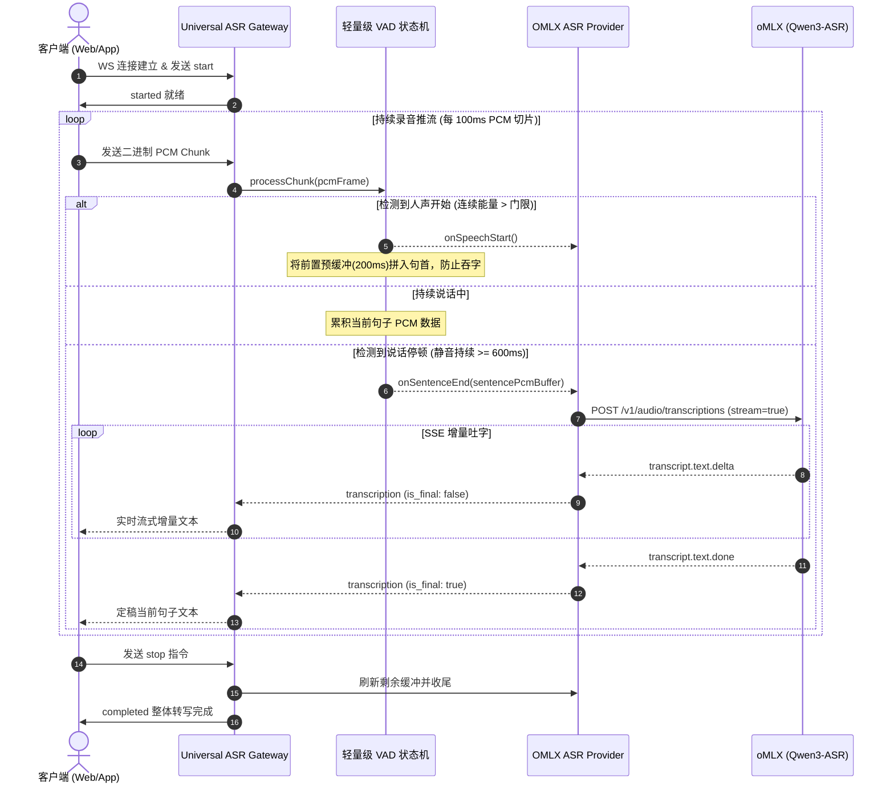
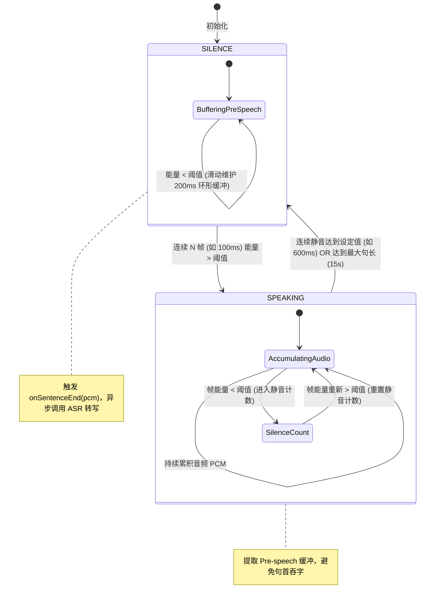

# 轻量级 VAD（静音检测与智能切句）方案设计文档

## 1. 概述与背景

在实时语音转写网关中，部分先进的端到端 ASR 大模型（如 **Qwen3-ASR**、**SenseVoice**、**Whisper 离线版**）具备高精度的转写能力，但后端并未提供原生毫秒级的双向音频流式推流解码接口，而是通过 `POST /v1/audio/transcriptions` 接口以文件/分块形式接收音频。

为了在**长音频连续录音/人机会话**场景下实现“**边说话边出字、说完一句立刻定稿**”的用户体验，网关层需要引入**轻量级 VAD（Voice Activity Detection，语音活动检测）**引擎：
1. **智能切句**：在用户持续说话时，实时监测人声的起始（Speech Start）与停顿结束（Speech End）；
2. **分段转写**：在检测到停顿（如静音 500ms~800ms）时自动切出句子音频块，并发起流式转写定稿；
3. **零感延迟**：无需等待用户手动发送 `stop`，实现高自然度的实时交互。

---

## 2. 技术选型对比

| 方案 | 原理 | 优点 | 缺点 | 适用场景 |
| :--- | :--- | :--- | :--- | :--- |
| **方案 1：纯 TS 能量阈值 + 过零率算法 (RMS + ZCR)** | 计算 PCM 样本的均方根能量（dBFS）与过零率，配合双缓冲状态机 | **零外部依赖、极低 CPU 开销（<0.1%）**、跨平台兼容性 100% | 极强噪背景下对微弱人声的区分度略逊于 AI 模型 | **网关默认推荐首选** |
| **方案 2：WebRTC VAD (GMM 高斯混合模型)** | 基于统计声学特征的轻量 GMM 模型 | 工业级标准、断句干脆、抗轻度环境底噪 | 依赖 Node.js 原生 C++ Binding 编译 | 服务端高并发语音流切片 |
| **方案 3：Silero VAD (ONNX 小模型)** | 基于 2MB 轻量神经网络 | 在极度嘈杂/音乐背景声下仍极准 | 需要引入 ONNX Runtime，有少量内存与推理开销 | 复杂车载/户外强噪场景 |

---

## 3. 总体架构与数据流



---

## 4. VAD 核心状态机设计



---

## 5. 关键算法与参数规范

### 5.1 核心参数配置表

| 参数名 | 默认值 | 取值范围 | 说明 |
| :--- | :--- | :--- | :--- |
| `sampleRate` | `16000` | 8000 ~ 48000 | 音频采样率 (Hz) |
| `frameSizeMs` | `20` | 10 ~ 30 | 单帧时间窗大小 (ms)，16kHz 下 20ms = 320 采样点 = 640 字节 |
| `energyThresholdDb` | `-38` | -50 ~ -25 | 能量判定门限 (dBFS)。低于此值视作静音，高于此值为人声 |
| `preSpeechMs` | `200` | 100 ~ 400 | 前置预缓冲时长 (ms)，用于补全首辅音爆破音 |
| `speechStartFrames` | `5` | 3 ~ 10 | 触发说话所需的连续发音帧数 (5帧 = 100ms) |
| `silenceEndFrames` | `30` | 15 ~ 50 | 触发切句所需的连续静音帧数 (30帧 = 600ms) |
| `maxSentenceMs` | `15000` | 5000 ~ 30000 | 单句最大时长保护 (ms)，超长时强制切句，防止延迟堆积 |

### 5.2 能量计算公式（dBFS）

对于 16-bit 线性 PCM 音频帧：

$$\text{RMS} = \sqrt{\frac{1}{N} \sum_{i=1}^{N} x_i^2}$$

$$\text{Energy (dBFS)} = 20 \times \log_{10} \left( \frac{\text{RMS} + \epsilon}{32768} \right)$$

*注：$\epsilon = 10^{-6}$ 用于防止对数为零。*

---

## 6. TypeScript 原型实现代码

```typescript
export interface VADConfig {
  sampleRate?: number;       // 采样率，默认 16000
  frameSizeMs?: number;      // 单帧时长，默认 20ms
  energyThresholdDb?: number;// 能量判定门限，默认 -38 dBFS
  speechStartFrames?: number;// 判定说话起始所需连续帧数，默认 5 帧 (100ms)
  silenceEndFrames?: number; // 判定切句所需连续静音帧数，默认 30 帧 (600ms)
  preSpeechMs?: number;      // 前置缓冲时长，默认 200ms
  maxSentenceMs?: number;    // 最大单句时长保护，默认 15000ms
}

export class LightweightVAD {
  private state: 'SILENCE' | 'SPEAKING' = 'SILENCE';
  private preSpeechBuffer: Buffer[] = [];
  private currentSentenceChunks: Buffer[] = [];
  private consecutiveSpeechFrames = 0;
  private consecutiveSilenceFrames = 0;

  private readonly config: Required<VADConfig>;

  constructor(
    config: VADConfig,
    private onSentenceEnd: (sentencePcm: Buffer) => void,
    private onSpeechStart?: () => void
  ) {
    this.config = {
      sampleRate: config.sampleRate ?? 16000,
      frameSizeMs: config.frameSizeMs ?? 20,
      energyThresholdDb: config.energyThresholdDb ?? -38,
      speechStartFrames: config.speechStartFrames ?? 5,
      silenceEndFrames: config.silenceEndFrames ?? 30,
      preSpeechMs: config.preSpeechMs ?? 200,
      maxSentenceMs: config.maxSentenceMs ?? 15000,
    };
  }

  /**
   * 接收并处理实时音频分片 (PCM)
   */
  public processChunk(chunk: Buffer): void {
    const frameByteSize = (this.config.sampleRate * 2 * this.config.frameSizeMs) / 1000;
    
    for (let offset = 0; offset < chunk.length; offset += frameByteSize) {
      const frame = chunk.subarray(offset, Math.min(offset + frameByteSize, chunk.length));
      if (frame.length < frameByteSize) break;

      const energyDb = this.calculateFrameEnergyDb(frame);
      const isSpeechFrame = energyDb > this.config.energyThresholdDb;

      if (this.state === 'SILENCE') {
        // 维持预缓冲环形队列
        this.preSpeechBuffer.push(frame);
        const maxPreFrames = Math.ceil(this.config.preSpeechMs / this.config.frameSizeMs);
        if (this.preSpeechBuffer.length > maxPreFrames) {
          this.preSpeechBuffer.shift();
        }

        if (isSpeechFrame) {
          this.consecutiveSpeechFrames++;
          if (this.consecutiveSpeechFrames >= this.config.speechStartFrames) {
            this.state = 'SPEAKING';
            this.consecutiveSilenceFrames = 0;
            // 拼入前置缓冲，防止首字丢失
            this.currentSentenceChunks = [...this.preSpeechBuffer];
            this.preSpeechBuffer = [];
            this.onSpeechStart?.();
          }
        } else {
          this.consecutiveSpeechFrames = 0;
        }
      } else if (this.state === 'SPEAKING') {
        this.currentSentenceChunks.push(frame);

        if (!isSpeechFrame) {
          this.consecutiveSilenceFrames++;
          if (this.consecutiveSilenceFrames >= this.config.silenceEndFrames) {
            this.commitSentence();
          }
        } else {
          this.consecutiveSilenceFrames = 0;
        }

        // 超长单句强制切句
        const currentDurationMs = this.currentSentenceChunks.length * this.config.frameSizeMs;
        if (currentDurationMs >= this.config.maxSentenceMs) {
          this.commitSentence();
        }
      }
    }
  }

  /**
   * 外部发送 stop 或连接断开时，冲刷并提交剩余未切句的音频
   */
  public flush(): void {
    if (this.state === 'SPEAKING' && this.currentSentenceChunks.length > 0) {
      this.commitSentence();
    }
  }

  private commitSentence(): void {
    if (this.currentSentenceChunks.length > 0) {
      const completeSentencePcm = Buffer.concat(this.currentSentenceChunks);
      this.onSentenceEnd(completeSentencePcm);
    }
    this.state = 'SILENCE';
    this.currentSentenceChunks = [];
    this.consecutiveSpeechFrames = 0;
    this.consecutiveSilenceFrames = 0;
  }

  /**
   * 计算单帧 PCM 信号的 dBFS 能量
   */
  private calculateFrameEnergyDb(frame: Buffer): number {
    let sumSquares = 0;
    const numSamples = frame.length / 2;
    for (let i = 0; i < frame.length; i += 2) {
      const sample = frame.readInt16LE(i);
      sumSquares += sample * sample;
    }
    const rms = Math.sqrt(sumSquares / numSamples);
    return 20 * Math.log10((rms + 1e-6) / 32768);
  }
}
```

---

## 7. 异常与边界场景处理

1. **爆破音/咳嗽/杂音短冲激**：
   - 通过 `speechStartFrames`（连续 5 帧，约 100ms）门限过滤瞬态杂音，避免偶发短脉冲误触发切句。
2. **极微弱停顿被误切**：
   - 通过 `silenceEndFrames`（连续 30 帧，约 600ms）保证逗号、自然换气等微小间隙不被切断。
3. **长时间无停顿长难句**：
   - `maxSentenceMs` 设定 15 秒硬上限，防止内存无限累积与延迟堆积。
4. **会话结束收尾**：
   - 客户端触发 `stop` 时调用 `flush()`，确保最后一句即使未达静音时长也能被完整提交识别。
